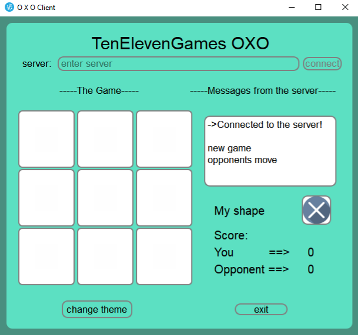
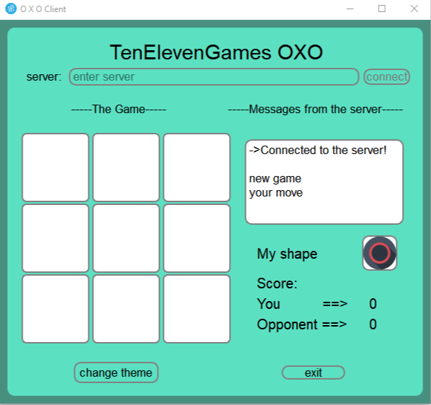

# PyQt5 Tic-Tac-Toe Game (BETA) Version! 

* Double-click the OXOGameServer.py file. This should start up the server window. 🚀 
* Start a game client by double-clicking the OXO_GAME_BETA.py file. This should start up a game client window. 🚀 
* Start another game client by double-clicking the OXO_GAME_BETA.py file. This should start up another game client window. 🚀 
* In each game client window you should be prompted to enter the server. This is the IP addresss for the game server. Because you are running everything locally enter *localy* in each client window and click the connect button. This should connect both clients to the game server, and should be displayed appropriately on the game server window, indicating that both clients are connected.

You should end up with 3 windows looking like this (1 for the game server 🖥, and 2 for the game clients 🖥️)

``

